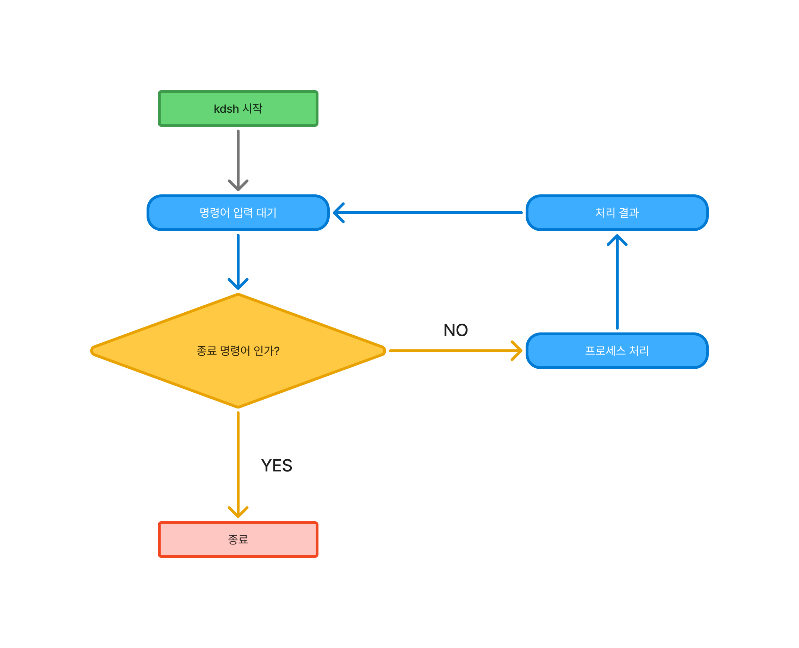

# KD SHELL
## Demo

## Environment
- OS : MacOS, Raspbian
- SKILL :
    - LANGUAGE &ensp;: Python3
- Tools : VSCode, Vim

## Description
나만의 스마트홈 디바이스에서 작동할 쉘
리눅스 명령어를 한글로 매칭시켜 처음 사용하는 사람들도 쉬게 사용할 수 있게 제작

- 위치 : pwd
- 새로고칭 : clear
- 이동 : mv
- 목록 : ls
    - -전부 : 모든 파일 및 디렉토리 출력 
- 만들기 : mkdir
- 삭제 : rm
    - -전부 : 해당 경로 모든 파일 및 디렉토리 삭제
- 설치 : 패키치 설치 명령어

### Flowchart : 

---
**presentation**: [slide](https://www.figma.com/deck/5LZyBV6V5nJU8HABgzfU5F/HOME-IoT-Python?node-id=1-42&t=nF6WKXo8afu3HhRC-1)
